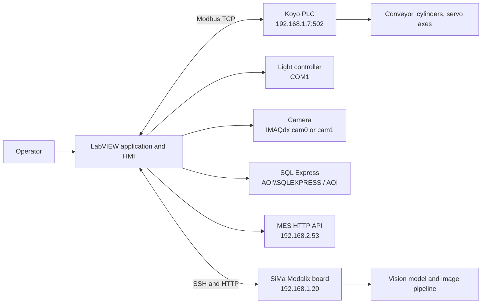
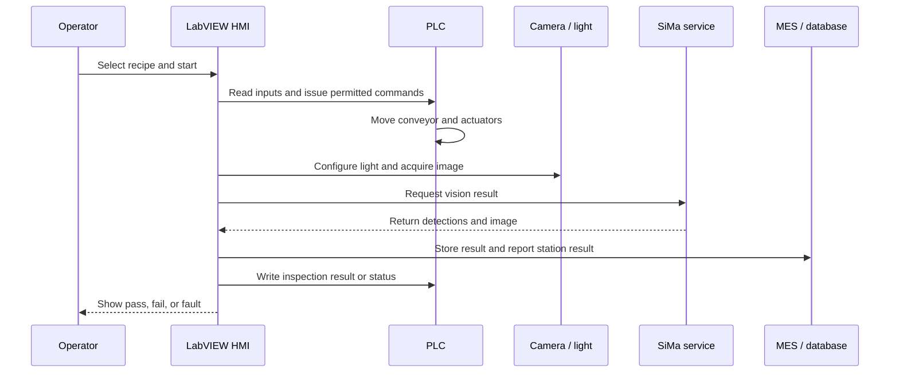

# Current Inspection System Architecture

## Purpose and safety boundary

The system inspects products while they move through a machine. A camera acquires an image, vision software determines whether the product passes or fails, the PLC controls physical motion, and the HMI lets an operator select work and view results.

The HMI is part of the control system, but it must not be the machine's only safety control. Loss of the HMI, Windows application, network, or vision service must leave the PLC capable of bringing the machine to a safe state.

## Confirmed component map

## Components

### LabVIEW application

**Evidence level: confirmed.**

The main LabVIEW project is `D:\Source Code\Inspection_Web\AOI\Inspection.lvproj`. It builds `Inspection.exe` and includes:

- Login and user permissions.
- Recipe, variant, and test-sequence editing.
- Test execution and manual machine control.
- Camera and lighting control.
- PLC communication and actuator checks.
- Reporting, SQL database access, and MES calls.
- A SiMa detection client.

LabVIEW is therefore both the operator interface and a machine-control/orchestration application. Replacing only its screens would not replace the current application's complete function.

### PLC and machine

**Evidence level: partially confirmed.**

LabVIEW communicates with a Koyo PLC using Modbus TCP at `192.168.1.7:502`. Koyo project files are under `D:\APP\Inspection\Resources\Koyo`.

The PLC projects show two pulse-servo axes:

| Axis | Registers found |
| --- | --- |
| Axis 1 | `R5000` through `R5004` |
| Axis 2 | `R5010` through `R5014` |

The projects also contain conveyor, cylinder, input, and output control.

**Critical unknown:** the exact Modbus coil and register map is not available in readable source. VI names do not prove address semantics. A replacement Modbus client must not be connected to the live machine until the LabVIEW VI diagrams are inspected or live request/response traffic is recorded and mapped.

### Camera and lighting

**Evidence level: confirmed configuration, unresolved active hardware path.**

The installed LabVIEW configuration refers to an NI IMAQdx camera named `cam0` or `cam1` and a light controller on `COM1`. Other Python scripts use a Basler GigE camera through `pypylon`.

These may represent different generations of the machine. The running application, physical camera, trigger wiring, and active driver must be checked before choosing a replacement camera interface.

### SiMa interface

**Evidence level: likely host-to-board contract.**

A Python host script connects over SSH to `sima@192.168.1.20` and starts or stops a pipeline beneath `/home/sima/BITSNew_ui/<pipeline>`. A Flask service on the board exposes port `5001`:

| Route | Purpose |
| --- | --- |
| `/run_inference` | Start an inference action. |
| `/get_detections` | Read the latest detections. |
| `/camera_display` | Control camera display. |
| `/stop_pipeline` | Stop a pipeline. |
| `/video_feed/camera` | Read an MJPEG live stream. |
| `/latest_frame` | Read the latest image. |

The LabVIEW project contains `Get_Detections.vi`, which strongly suggests that it calls the board service. The serialized VI does not expose enough text to prove the exact route or payload contract.

### Data services

**Evidence level: confirmed.**

- SQL Server: `AOI\\SQLEXPRESS`
- Database: `AOI`
- MES base URL: `http://192.168.2.53/FM_INT_API`
- MES functions found: user authentication, station status, previous-station status, station result, and API health.

## Logical control and data flow

This is a logical reconstruction, not a verified timing diagram. The real operation order, handshakes, trigger edges, retry policy, timeout values, and PLC signals require live measurement.

## Main risks and blockers

1. The PLC I/O and Modbus map is unknown. This is the primary safety blocker for a live replacement.
2. Fixed IP addresses, paths, and credentials appear in scripts.
3. At least three conflicting vision-input arrangements exist: host capture, host RTSP, and direct-board GigE capture.
4. There is no local proof that the newest SiMa package is installed and running on the board.
5. The current timeout, recovery, and fail-safe behavior has not been documented.

## Evidence required before replacement control

- Record and annotate Modbus traffic for every machine state and manual action.
- Inspect LabVIEW block diagrams for register meaning, sequencing, interlocks, and timeouts.
- Verify which camera, trigger mode, lighting controller, and acquisition path are physically active.
- Capture HTTP/SSH contracts, payloads, error responses, and board startup behavior.
- Verify PLC-owned safety behavior by deliberately disconnecting the HMI and vision services under controlled conditions.
- Record the complete inspection cycle with timestamps and correlate HMI, PLC, camera, SiMa, SQL, and MES events.
