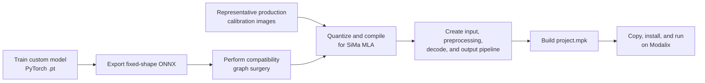
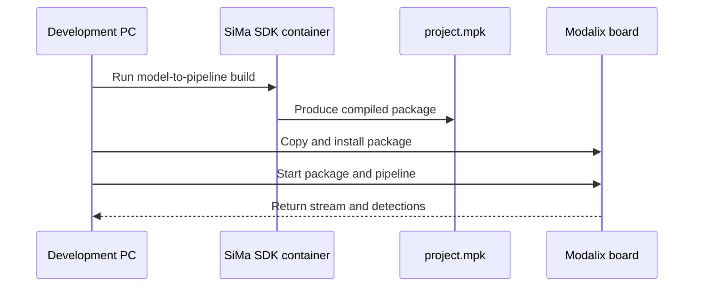

# SiMa Modalix Model Build and Deployment

## Role of the board

The SiMa Modalix board performs the neural-network inference close to the inspection machine. Its deployable package contains the compiled model, preprocessing pipeline, detection decoding, and runtime configuration. The package extension is `.mpk`.

For the first replacement release, the board should remain in service behind a stable `InferenceAdapter` in the host backend. This separates the HMI/control migration from AI performance changes.

## Known local model assets

| Area | Assets and current evidence |
| --- | --- |
| Wood | `best.pt`, `best.onnx`, `best-post-surgery.onnx`, class definitions, calibration images, and a generated package project. |
| Screws | `best.pt`, ONNX files, class definitions, and a generated package project. |
| Built Wood package | `Wood_simaaisrc/project.mpk`; local logs report a successful build on 2026-06-03. |
| Generated runtime output | `yolov8_stage1_mla.elf`, preprocessing, postprocessing, and MLA-process JSON resources. |

The Wood detector is a custom three-class YOLOv8 model. It is not the standard 80-class COCO detector.

## Build flow

The local conversion tool is `D:\Sima_Projects\tool-model-to-pipeline`. Its guide is `D:\Sima_Projects\tool-model-to-pipeline\docs\en\Guide\Getting_Started_with_YOLO_on_Modalix_v1.2.md`.

### Build stages

1. Train a detector on the production defect classes.
2. Export a fixed-input-shape ONNX model.
3. Apply graph surgery to remove or replace operations unsupported by the compiler.
4. Quantize and compile using representative production images.
5. Assemble image input, preprocessing, model execution, box decoding, and output transport.
6. Build `project.mpk`.
7. Copy, install, start, and validate the package on the board.

## Supported model strategy

The local tool directly supports YOLOv8, YOLOv8 segmentation, YOLOv9, YOLOv10, YOLO11, and YOLO11 segmentation.

A custom YOLO detector is therefore the lowest-risk model path: keep the supported family and fixed input/output contract, but train on the required defect classes. An arbitrary ONNX network is not necessarily a drop-in replacement; it may require compatible SiMa SDK/compiler support and custom preprocessing, output decoding, and runtime integration.

Use another architecture only if offline evaluation demonstrates a material accuracy or robustness improvement that justifies the integration cost.

## Deployment path and proof level

**Confirmed:** local compilation and MPK creation completed.

**Not confirmed:** the available evidence does not prove that the Wood or Screws MPK is currently installed, selected, and running on the physical board.

The supplied remote runner indicates the expected access method: SSH/SCP as user `sima`, followed by interaction with the SiMa runtime service. It also creates a temporary virtual environment and copies a model archive.

## Deployment UI defect

The deployment UI contains an MPK deployment function, but its `/deploy` route invokes `create_inspection_file()` instead. That action copies or rewrites a Python wrapper; it does not invoke the MPK deployment function.

A success message from this web page is therefore not evidence that a model was installed.

## Required deployment verification

For every release, record:

1. MPK file name, semantic model version, build timestamp, and checksum.
2. Board serial/identity and target pipeline directory.
3. Copy/install command result and runtime service state.
4. Active process, pipeline name, and startup logs.
5. Configuration checksum and class-label order.
6. Result from a versioned known test image, including expected detections.
7. Model version returned through the host API with every inspection result.
8. Rollback package and a tested rollback procedure.

## Conflicting network configurations

| Configuration | Model input | Output | Evidence state |
| --- | --- | --- | --- |
| Compiled Wood MPK | `rtsp://192.168.1.10:8554/mystream1` | UDP H.264 to `192.168.1.17:5010` | Present in generated configuration. |
| Windows Basler streamer | `rtsp://192.168.1.17:8554/basler` | RTSP publisher | Present in a local script. |
| Board Flask wrapper | Direct `aravissrc` GigE camera | Board HTTP/MJPEG service | Present in a local script. |

These values describe mutually inconsistent active paths unless an undocumented bridge exists. The deployed camera source, stream owner, IP allocation, and output consumer must be resolved on the live machine.

## Recommended release approach

- Preserve the Modalix board for the initial HMI/backend replacement.
- Encapsulate board communication behind an `InferenceAdapter` with explicit timeouts, health state, model version, and structured errors.
- Treat deployment and activation as separate verified operations.
- Run the new host integration in shadow mode before its decision can affect the PLC.
- Later benchmark the identical model on the industrial PC with ONNX Runtime or another supported runtime.
- Remove the board only if host inference satisfies measured cycle time, accuracy, thermal behavior, recovery, and long-duration reliability requirements.
