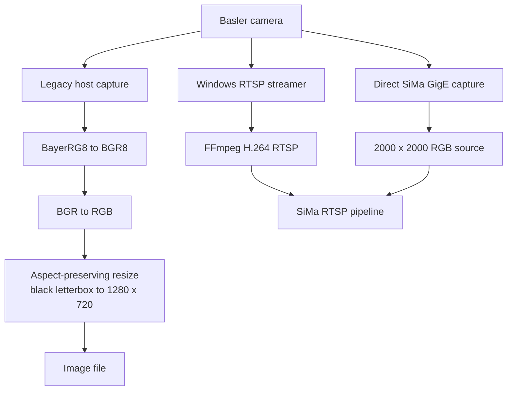
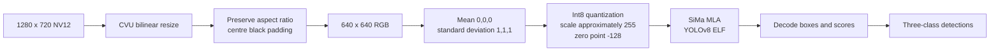

# Image Acquisition and Preprocessing Pipeline

## Why the exact pipeline matters

Preprocessing converts camera pixels into the tensor expected by the trained model. Image size, crop, aspect ratio, padding, colour order, numeric normalization, and quantization are part of the model contract. A model trained and calibrated with one contract can produce incorrect results when any of these details change.

## Three locally represented acquisition paths



These are separate candidate or historical paths. Available evidence does not show that all three run together or identify which one is active in production.

## Path 1: legacy host capture

**Source:** `D:\Source Code\Inspection_Web\AOI\Resources\PY Files\Capture_Image.py`


Bayer conversion reconstructs full colour pixels from the raw sensor pattern. The code then changes the channel order and letterboxes the image rather than stretching it.

The saved image's encoding must still be checked at the consumer boundary: some image libraries interpret file data as BGR even when the producer's in-memory array was explicitly reordered.

## Path 2: Windows Basler RTSP stream

**Source:** `D:\Sima\Basler\basler_rtsp_stream.py`

The script opens a Basler camera, converts frames to BGR8, and pipes raw BGR frames to FFmpeg. FFmpeg encodes H.264 and publishes an RTSP stream. The configured acquisition is 2560 x 1440 at 18 frames per second, with the stream at `rtsp://192.168.1.17:8554/basler`.

This path is useful for live display and can feed inference, but it adds H.264 encode/decode latency, buffering, compression artifacts, and possible stale-frame ambiguity. A hardware-triggered one-shot acquisition is generally more repeatable for inspection of a moving part, subject to validation on the actual machine.

## Path 3: compiled Wood SiMa pipeline

**Sources:** generated `mpk.json` and pipeline resources beneath the Wood package project.



### Known model contract

| Setting | Value |
| --- | --- |
| Pipeline input | 1280 x 720, NV12 |
| Model input | 640 x 640, RGB |
| Resize | Bilinear, aspect ratio preserved |
| Padding | Centred, black |
| Normalization | Mean `[0, 0, 0]`, standard deviation `[1, 1, 1]` |
| Model numeric type | Signed 8-bit integer |
| Approximate input quantization | Scale about `255`, zero point `-128` |
| Detection confidence threshold | `0.1` |
| NMS IoU threshold | `0.3` |
| Maximum detections retained | `100` |
| Class order | `ChipOff`, `Major`, `Minor` |

The model has six output heads: box and class-score outputs at 80 x 80, 40 x 40, and 20 x 20 grids. The decoder combines these heads into final detections.

## Geometry and coordinate mapping

The direct-board wrapper starts from a 2000 x 2000 image and uses `videoscale` to produce 1280 x 720. SiMa preprocessing then performs another aspect-preserving transform and pads to 640 x 640.

The wrapper maps result boxes back to the display using independent X/Y scales plus fixed `X=20` and `Y=25` corrections. That is not a complete inverse of the two resize/padding operations. It can misplace boxes, corrupt recipe-region decisions, and produce misleading overlays or reports.

Each frame should carry one explicit transform record:

```text
source_width, source_height
crop_x, crop_y, crop_width, crop_height
resize_scale_x, resize_scale_y
pad_left, pad_top, pad_right, pad_bottom
model_width, model_height
frame_id, capture_timestamp
```

Every decoded model box must be mapped through the exact inverse transform. Fixed pixel offsets should be removed unless a documented physical calibration demonstrates that they represent lens, sensor, or fixture alignment rather than compensating for incorrect resize math.

## Canonical mapping approach

For an aspect-preserving letterbox from source size `(W, H)` to model size `(Mw, Mh)`:

```text
scale = min(Mw / W, Mh / H)
resized_w = W * scale
resized_h = H * scale
pad_x = (Mw - resized_w) / 2
pad_y = (Mh - resized_h) / 2

source_x = (model_x - pad_x) / scale
source_y = (model_y - pad_y) / scale
```

If a crop or a non-uniform 2000 x 2000 to 1280 x 720 scale occurs earlier, it must be represented as another transform and inverted in reverse order. Coordinates should be clipped only after the full inverse mapping.

## Recommended improvement order

1. Identify and freeze one authoritative camera-to-model path.
2. Save raw, uniquely identified production frames before lossy encoding or resizing.
3. Make exposure, gain, white balance, focus, trigger timing, and lighting recipe-controlled and logged.
4. Implement exact transform metadata and inverse coordinate mapping.
5. Evaluate controlled crop/region-of-interest selection using labelled production data.
6. Train and calibrate with images generated by the exact deployed preprocessing path.
7. Tune confidence and NMS thresholds per validated decision requirements, not merely visual appearance.
8. Detect stale, duplicated, missing, overexposed, underexposed, and blurred frames explicitly.

## Validation procedure

Do not tune preprocessing directly on a decision-making production path.

1. Collect representative raw images across products, defects, shifts, lighting variation, and normal process variation.
2. Create immutable labelled truth with product identity and inspection regions.
3. Run the current and candidate pipelines offline on the same frames.
4. Compare pass/fail decisions, class errors, boxes, confidence, region mapping, and processing time.
5. Recalibrate and rebuild the SiMa quantized model whenever the deployed input distribution materially changes.
6. Run the candidate in shadow mode and correlate results by frame ID without writing decisions to the PLC.
7. Promote only after agreed accuracy, cycle-time, stale-frame, recovery, and repeatability criteria pass.

## Unresolved questions

- Which camera path is active on the live machine?
- Is acquisition free-running, software-triggered, or hardware-triggered?
- Where is the inspection frame selected relative to conveyor motion and PLC state?
- Does the active board package expect RTSP, direct GigE, or another input?
- Is the 2000 x 2000 to 1280 x 720 operation a stretch, crop, or aspect-preserving scale?
- Which component owns colour conversion, and what exact channel order reaches the model?
- How are a frame, inference result, product ID, PLC cycle, database record, and MES transaction correlated?
- What confidence/region rules convert detections into the final pass/fail decision?
