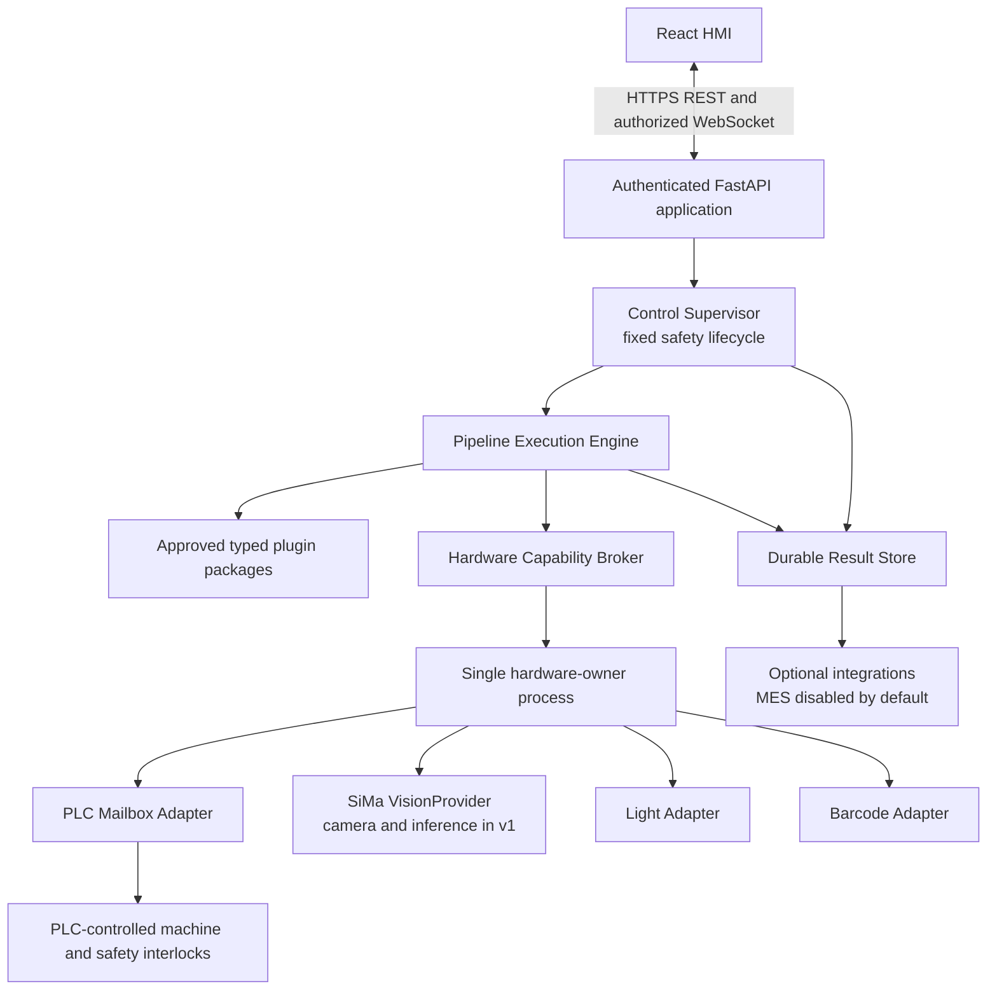
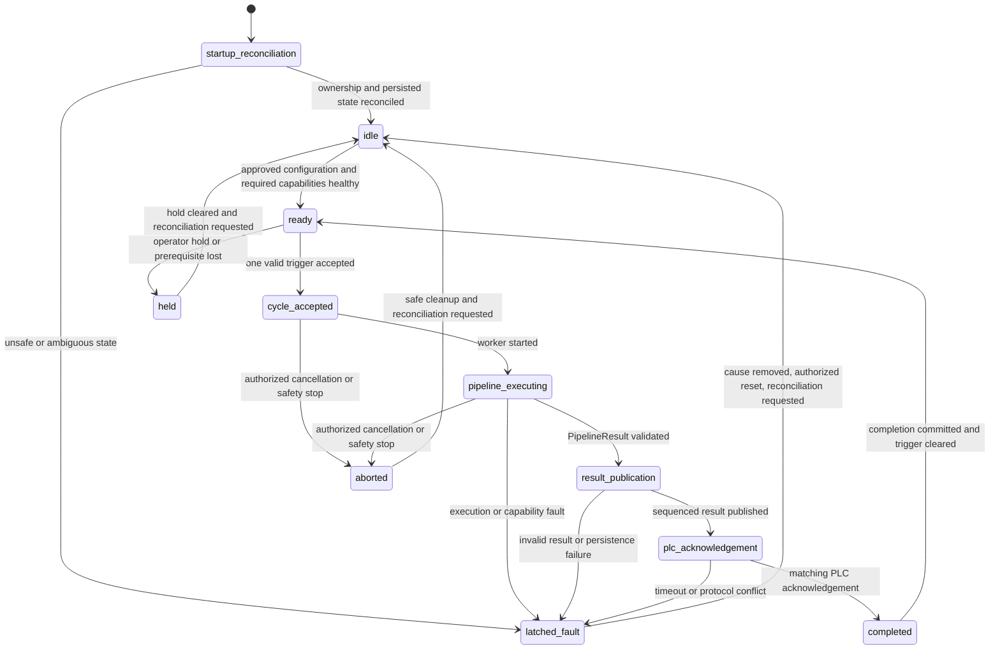
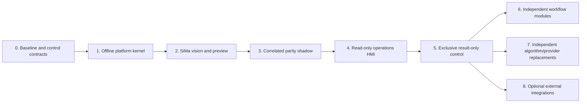

# Replacement Architecture: Modular Inspection Platform

## Goal and design boundary

Replace the LabVIEW application with a fully custom, code-native inspection platform, not a Python recreation of LabVIEW. The platform uses a React HMI and an authenticated FastAPI application. Hardware, vision, decision logic, persistence, reporting, and external integrations are modules behind stable contracts so that each can be replaced independently.

The supervisory safety lifecycle is fixed and platform-owned. Inspection behavior is customizable through versioned, typed Python pipeline packages authored in code, reviewed in version control, validated in CI, and approved before deployment. A pipeline can request controlled capabilities; it cannot access PLC registers or hardware directly. The HMI can select an approved pipeline version, but in v1 it cannot edit code, inject scripts, or construct pipelines.

The PLC retains emergency-stop handling, safety circuits, low-level motion, motion limits, machine interlocks, and the safe response to loss of the PC, network, or vision system. The replacement must not weaken those controls.

## Evidence and decision status

- **Verified production fact:** observed in the production system or its deployed artifacts.
- **Selected v1 decision:** the architecture to implement for the initial replacement.
- **Commissioning output:** evidence that must be produced and approved before control authority is granted.

### Production baseline

| Status | Baseline statement |
| --- | --- |
| Verified production fact | The deployed SiMa path directly acquires from a Basler camera and serves the current board application on TCP port `5001`. |
| Verified production fact | The production capture path supplies `3200 x 2256` source frames. |
| Verified production fact | Production inspection uses multi-step recipes rather than a single fixed inference call. |
| Verified production fact | Existing artifacts reference legacy SQL and MES services, but those dependencies are not available to the replacement development environment. |
| Commissioning output | The exact PLC coil/register meanings, timing, interlocks, and safe defaults remain unresolved and require ladder/LabVIEW review and controlled measurement. |

SiMa and the active model remain the v1 production baseline. Legacy behavior is reproduced for parity with new modules; legacy implementation details need not be preserved. Individual algorithms, models, cameras, or providers can be replaced after parity is accepted.

## Platform architecture



### Process isolation and ownership

The runtime has three trust and failure boundaries:

1. The **FastAPI application process** authenticates users and service accounts, exposes REST/WebSocket APIs, validates commands, and presents state. It does not own device connections.
2. The **single hardware-owner process** owns persistent PLC, light, barcode, and vision-provider sessions. It enforces exclusive access, interlocks, deadlines, correlation identifiers, and safe cleanup.
3. A **supervised pipeline worker** loads exactly one approved immutable pipeline package for a cycle. Exceptions, hangs, malformed output, cancellation failures, or resource exhaustion terminate and replace the worker without terminating the hardware owner.

IPC between these processes is typed, bounded, authenticated locally, and correlated by `cycle_id` and request sequence. Only the Control Supervisor can accept a cycle. Two browsers, API calls, or workers cannot create overlapping control ownership.

## Fixed supervisory lifecycle



Canonical state names are `startup_reconciliation`, `idle`, `ready`, `cycle_accepted`, `pipeline_executing`, `result_publication`, `plc_acknowledgement`, `completed`, `held`, `aborted`, and `latched_fault`.

Startup never assumes an in-flight command or result is safe to repeat. Reconciliation compares durable cycle state, mailbox sequence IDs, PLC ownership, heartbeat state, and hardware health before entering `idle`. A latched fault requires its cause to be removed, an authorized reset, and another reconciliation.

### Customizable pipeline sequence

Within `pipeline_executing`, approved pipeline code may define motion requests and settling, lighting, capture, preprocessing, inference, classical vision, decision aggregation, and evidence/report artifacts.

Every action passes through audited capability APIs. Plugin code is prohibited from opening Modbus, camera, serial, filesystem, database, SSH, or arbitrary network connections. OS sandboxing, dependency allowlists, worker permissions, and runtime resource limits enforce this rule in addition to code review.

Manual mode is a separate, role-restricted command workflow; it is not a pipeline escape hatch. Manual commands use the same Hardware Capability Broker, PLC ownership fence, interlocks, audit log, validation, timeouts, and cancellation behavior.

## Typed plugin SDK

```python
class InspectionPipeline(Protocol):
    async def execute(
        self,
        context: CycleContext,
        capabilities: InspectionCapabilities,
    ) -> PipelineResult: ...
```

### `CycleContext`

`CycleContext` is immutable and contains `cycle_id`, `part_id`, optional sanitized barcode identity, `recipe_id` and version, pipeline name/version/checksum, operator or initiating service-account identity, accepted time, monotonic deadline, and clock-synchronization status. The worker cannot mutate context or replace these identifiers.

### Capability interfaces

- `MotionCapability`: submit a named motion intent and await PLC-confirmed completion; never expose registers.
- `LightingCapability`: apply an approved lighting profile and confirm state.
- `VisionCapability`: request atomic capture/inference or capture-only operations from a `VisionProvider`.
- `BarcodeCapability`: await or validate barcode input.
- `ArtifactCapability`: write evidence through the Durable Result Store; never expose a filesystem path.
- `EventCapability`: emit schema-validated structured events correlated with the cycle and step.

Every request has an idempotency key, deadline, cancellation token, and structured outcome. The broker independently verifies that the active package declared the requested capability.

### `PipelineResult`

The canonical result enum is exactly `PASS`, `FAIL`, `NO_RESULT`, `FAULT`, or `ABORTED`.

`PipelineResult` contains the final enum and stable reason code; ordered, uniquely identified step results and timing; evidence references and frame/result correlation IDs; safe diagnostics; and the pipeline, model, preprocessing, and configuration versions used.

`NO_RESULT` means inspection completed without sufficient evidence for a product decision. `FAULT` means execution or a required capability failed. `ABORTED` means a cycle was deliberately cancelled or stopped. None is silently converted to `PASS` or `FAIL`.

### Package manifest and configuration

Each immutable package manifest contains:

- package name and semantic version;
- code checksum and configuration-schema version;
- compatible platform-version range;
- required named capabilities and compatible contract versions;
- model and preprocessing dependencies with immutable checksums;
- release approval/signature metadata.

Configuration is validated against the versioned schema and can tune approved code only. It cannot contain executable Python, shell commands, side-effecting expressions/templates, or downloadable code.

Pipeline implementations must honor cancellation, per-step and cycle deadlines, memory/CPU quotas, bounded artifact output, and deterministic cleanup. CI performs type checking, contract tests, offline replay, dependency/policy checks, and fault injection before approval.

Approved packages are immutable. Activation is allowed only in `idle`, is transactional, and is audited. The platform rejects incompatible or unsigned/unapproved packages. One command rolls back to the previous approved version. Hot reload or package/configuration changes during an inspection are prohibited; the selected package remains pinned through cycle completion and restart recovery.

## Hardware contracts

### SiMa `VisionProvider` in v1

SiMa owns Basler camera acquisition and inference in v1. The platform does not open a second camera session. Each inspection request returns one atomic frame/result pair containing:

- `cycle_id`, `vision_request_id`, and `frame_id`;
- capture/inference timestamps and clock source;
- source geometry, including `3200 x 2256` for the production path;
- model, preprocessing, and provider versions/checksums;
- confidence scores, detections, and coordinate-space definition;
- explicit status and fault code, including timeout and invalid/stale frame;
- references to the exact raw/derived image artifacts.

The provider reports mismatched cycle/frame IDs; the broker rejects stale, duplicate, or mismatched responses. A result is never paired with an independently fetched latest frame.

Preview is a non-consuming, bounded fan-out from published frames. Multiple HMI clients receive copies or references without competing with inspection capture or consuming the existing single-consumer MJPEG queue. Slow clients drop preview frames rather than delaying capture or inference.

SSH is limited to deployment and lifecycle management under a service account. Inspection, health, preview, and result traffic use the versioned provider API. Later host inference, alternate cameras, or other accelerators implement the same `VisionProvider` contract without changing pipeline or HMI contracts.

### PLC mailbox

The dedicated PLC mailbox's ladder behavior and physical Modbus addresses are commissioning outputs. Its logical contract includes:

- backend request and result sequence IDs with defined width and wraparound comparison;
- PLC acknowledgements that echo the accepted sequence ID;
- independent heartbeat counters and timeout behavior;
- result encoding for `PASS`, `FAIL`, `NO_RESULT`, `FAULT`, and `ABORTED`;
- explicit ready, busy, held, and fault/latched-fault state;
- startup reconciliation and stale/duplicate result rejection;
- a PLC-enforced control-owner token/fence so LabVIEW and the replacement cannot both command the mailbox.

Writes are idempotent for the same sequence and rejected for an unexpected owner or stale sequence. Heartbeat loss or an ambiguous restart leaves the PLC in its approved safe state. The PLC owns the physical response, including reject behavior; the backend communicates intent/result only through the approved mailbox.

Packet capture can help reconstruct timing but cannot approve the interface by itself. Ladder review, LabVIEW behavior review, named-signal mapping, safety analysis, and controlled commissioning tests must approve the mailbox before production writes.

### Light and barcode adapters

Light and barcode devices are replaceable adapters owned by the hardware process. They expose typed profiles and observations, not ports or serial commands. Health, timeout, retry, safe-state, and identity behavior is defined per adapter and tested through the broker contract.

## Persistence and recovery

The Durable Result Store is authoritative for cycles, lifecycle transitions, recipe/pipeline/model/preprocessing versions, step results, structured events, images/artifacts, configuration activations, user actions, and audit records.

Cycle completion is transactional: the final `PipelineResult`, required evidence metadata, lifecycle event, and PLC-publication intent are durably recorded so restart reconciliation can determine what was acknowledged. Managed artifact storage records immutable hashes and retention state in the authoritative database.

The implementation defines and tests database recovery, backup/restore, disk quotas, retention, low-space thresholds, safe disk-full behavior, log rotation, corruption handling, and power-loss recovery. Hosts, PLC, SiMa, and database use monitored clock synchronization; monotonic time controls deadlines and synchronized wall time supports correlation/audit.

## API and security

- HTTPS is required; WebSockets use the same authentication, authorization, origin policy, and cycle-level access checks.
- RBAC separates viewing, operation, manual command, configuration approval, pipeline activation, maintenance, and audit administration.
- Browser mutations use CSRF protection and strict origin controls.
- Services use least-privilege identities, authenticated IPC, and rotated secrets. Plaintext credentials in source, configuration, URLs, scripts, or logs are removed.
- Every command records actor, role, request ID, previous/new state, reason, and outcome.
- FastAPI schemas validate all external input; rate limits and command serialization prevent concurrent or replayed control actions.

## Optional integrations

MES is an optional post-result integration plugin and is disabled by default in v1. When disabled it reports `not_applicable`, creates no alarm, performs no network calls, and never affects `ready`, inspection timing, result publication, or PLC acknowledgement.

Future enablement has a separate acceptance gate and requires an idempotent transactional outbox, bounded asynchronous delivery, durable retry/dead-letter state, stable idempotency keys, and a duplicate-safe MES contract. MES remains outside the time-critical lifecycle.

## Functional delivery phases

### Phasing rule

A phase is complete only when its result is usable, tested, observable, documented, and reversible without any later phase. Dependencies point backward only: later phases may consume earlier versioned contracts, but an earlier phase cannot contain a placeholder, unsafe fallback, deferred recovery path, or incomplete operating procedure that a later phase must repair.

Every phase includes its own schema changes, security, health reporting, audit events, failure handling, tests, deployment evidence, operating procedure, and rollback. Completed contracts remain supported; an incompatible change requires a new contract version plus its compatibility adapter or migration in the same release.



Phases 6, 7, and 8 are independent branches. They may be scheduled in any order; no release on one branch is a prerequisite for another.

### Phase 0: Freeze the baseline and approve control contracts

**Functional outcome:** a versioned production baseline and approved safety/PLC commissioning package. This is a complete evidence product and makes no production control change.

Record the LabVIEW, PLC, SiMa, camera, model, preprocessing, recipe, timing, SQL/MES, network, and clock baselines. Resolve mailbox meanings and addresses, sequences, acknowledgements, owner fence, heartbeat, safe defaults, timing, restart cases, and PLC-owned interlocks through ladder/LabVIEW review and controlled measurement.

**Completion boundary:** the signed baseline manifest, safety matrix, signal map, timing and mailbox contracts, evidence archive, and rollback/reference artifacts are usable on their own. PLC writes remain disabled until this phase is approved.

### Phase 1: Deliver the offline platform kernel

**Depends on:** Phase 0 terminology and logical contracts, but not live hardware.

**Functional outcome:** an authenticated, durable platform that executes approved packages end to end against deterministic replay/simulated capabilities.

Deliver the canonical schemas, fixed Control Supervisor, Durable Result Store, transactional completion, startup reconciliation, SDK, package approval/activation/rollback, broker, isolated worker, authenticated IPC, replay adapters, and FastAPI APIs. Complete backup/restore, retention, disk-full handling, audit integrity, identities, quotas, deadlines, cancellation, and crash/power-loss recovery for this scope.

**Completion boundary:** a sample approved pipeline runs from acceptance to durable completion; restart recovery, rollback, command serialization, sandbox tests, capability faults, and worker failure injection pass. This release supports CI, pipeline development, and training without SiMa, PLC, MES, or React.

### Phase 2: Add atomic SiMa vision and bounded preview

**Depends on:** Phase 1 vision, provider, artifact, persistence, event, and authentication contracts.

**Functional outcome:** exact SiMa frame/result pairs can be requested, validated, persisted, replayed, and previewed safely. PLC control remains disabled.

Deliver the v1 provider, ID correlation, geometry/coordinate validation, version identity, explicit faults, exact artifacts, health behavior, and bounded non-consuming fan-out. Include standalone diagnostics and a recorded fallback corpus.

**Completion boundary:** stale, duplicate, mismatched, malformed, and out-of-order responses are rejected; restart, timeout, camera loss, and inference failure have defined outcomes; slow preview clients cannot affect inspection. Rollback returns to Phase 1 replay operation.

### Phase 3: Deliver parity inspection in correlated shadow mode

**Depends on:** the Phase 0 baseline and Phase 1-2 execution and vision services.

**Functional outcome:** the replacement produces durable, cycle-correlated parity results beside LabVIEW with no PLC command or result authority.

Deliver the immutable multi-step parity package and all adapters needed for shadow execution. For actions still owned by LabVIEW/PLC, consume correlated observations or recorded responses instead of issuing duplicate commands. Pin all pipeline, configuration, model, preprocessing, threshold, and timing versions, and classify every comparison difference.

**Completion boundary:** approved good, bad, missing-part, boundary, recipe, timeout, and failure cases meet quality/timing criteria; discrepancies are dispositioned; shadow mode cannot write PLC control or result registers. Rollback stops shadow intake without affecting production.

### Phase 4: Deliver the read-only operations HMI

**Depends on:** Phase 1 APIs/state schemas and Phase 2-3 real health, image, step, and result data.

**Functional outcome:** operators can securely observe the complete shadow system without control authority.

Deliver React views for lifecycle, health, exact images/overlays, package versions, steps/results, alarms, events, and audit. Complete REST/WebSocket authorization, reconnect, origin/CSRF protection, redaction, accessibility, and multi-browser limits. Mutating controls are absent and server-rejected, not deferred placeholders.

**Completion boundary:** operator and security acceptance pass. Documented backend procedures remain sufficient if the HMI is unavailable or rolled back.

### Phase 5: Grant exclusive result-only production authority

**Depends on:** approved Phase 0 commissioning evidence and accepted Phase 1-4 parity, recovery, security, persistence, and operating evidence.

**Functional outcome:** the replacement exclusively owns the mailbox and publishes sequenced results; the PLC continues to own safety, motion, interlocks, and physical reject behavior.

Enable live reconciliation, owner fencing, heartbeat, result encoding, sequence/acknowledgement handling, ambiguous-state latching, and authorized reset. Transfer ownership during a controlled outage only after LabVIEW relinquishes it. Include monitoring, stop criteria, staffing, and tested cold LabVIEW rollback.

The cutover scope includes every live capability required by the production parity package. If the selected recipe requires backend-requested motion, lighting, or barcode behavior, that capability's complete adapter, interlocks, recovery, tests, and operating procedure move into this phase; it cannot be deferred to Phase 6. A result-only cutover is allowed only for recipes whose other actions remain autonomously and safely PLC-owned.

**Completion boundary:** restart, heartbeat loss, stale/duplicate sequence, acknowledgement timeout, ownership conflict, concurrent trigger, network/vision loss, disk fault, and rollback trials pass. This production release does not depend on manual controls, MES, new models/cameras, or Phase 6-8.

### Phase 6: Migrate each remaining workflow as an independent release

**Depends on:** only Phase 5 contracts and the particular workflow/device contract.

**Functional outcome:** each chosen legacy workflow is replaced and reversible without coordinating other remaining workflows.

Any remaining barcode, lighting, manual-command, recipe/configuration, reporting, retention-administration, or other workflow is a separate subphase (`6a`, `6b`, and so on). Each includes its full adapter/API/HMI vertical slice, authorization, audit, health/safe-state behavior, evidence, training, procedure, and rollback. If a new pipeline needs a remaining workflow, finish its whole subphase before activating that pipeline.

**Completion boundary:** unmigrated workflows continue through their approved existing path. Rolling back one migrated module cannot stop unrelated modules or the Phase 5 inspection core.

### Phase 7: Replace each algorithm, model, or provider independently

**Depends on:** Phase 5 and only the contracts used by the item being replaced.

**Functional outcome:** one preprocessing step, vision function, decision rule, model, inference provider, or camera is replaced per release without changing the lifecycle or unrelated consumers.

Each replacement includes immutable versioning, replay, accuracy/timing evidence, fault injection, shadow comparison, approval, idle-only activation, rollback, and any needed compatibility adapter.

**Completion boundary:** the individual replacement is production-ready and reversible on its own; no HMI, SDK, or pipeline change needed by it is deferred to another release.

### Phase 8: Add each optional external integration independently

**Depends on:** the Phase 5 committed result/event contract only. It is never a readiness, inspection, acknowledgement, Phase 6, or Phase 7 dependency.

**Functional outcome:** one optional consumer, such as MES, receives results asynchronously without entering the control lifecycle.

Each integration is a separate leaf release with its own outbox consumer, authentication, idempotency, bounded retry, dead-letter handling, observability, data governance, and disable/rollback control. Disabled remains fully supported: `not_applicable`, no traffic, no alarm, and no readiness effect.

**Completion boundary:** destination loss, slowness, duplication, malformed replies, secret rotation, or prolonged outage cannot delay or change inspection or PLC publication. Removing one integration leaves the core and every other integration operational.

## Design approval

Controls, safety, vision, software, and production owners review this architecture and approve the commissioning outputs, safety matrix, PLC mailbox, timing contract, parity evidence, rollback procedure, and operational ownership before production authority is granted.
