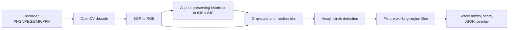

# DIY Board Inference Demo

This is a clean-room learning pipeline. It does not use an MPK, SiMa model resources, SiMa GStreamer plugins, `/data/simaai/applications`, a camera, or a production HTTP service.

The detector is intentionally not an AI model. It finds likely circular screw heads in the upper fixture/PCB working region and labels them `screw`. Its purpose is to prove the entire independent deployment path: image upload, decoding, preprocessing, computation, geometry mapping, response JSON, overlays, logging, startup, and failure handling.

It listens on port `5003` and is isolated from the existing service on port `5001`.

## API

| Endpoint | Method | Purpose |
| --- | --- | --- |
| `/health` | GET | Runtime/dependency status. |
| `/contract` | GET | Detector and preprocessing configuration. |
| `/infer` | POST multipart | `image` file and optional `frame_id`; returns JSON. |
| `/runs/<run_id>/result` | GET | Saved result JSON. |
| `/runs/<run_id>/overlay` | GET | Saved annotated PNG. |

The runtime stores only its temporary input, JSON, and overlay under `/tmp/diy-inference-demo` on the board. It never copies results to another PC.

## Detection limitations

The `screw` boxes are not defects and must not drive pass/fail decisions. Circle and ROI settings are exposed in `/contract` so their effect can be learned from recorded images. The current ROI is tuned only to the upper screw row in `DUT1/2.png`; make it recipe-specific before testing another fixture. Replace only the `detect_screws()` function when introducing a real inference engine later; preserve the input, transform, JSON, error, and overlay contract.
