# SiMa Frame Fan-Out and Admin-PC Overlay Implementation Plan

## 1. Objective

Replace the current result-delivery pattern for the experimental pipeline with a
single-camera-owner architecture:

```text
Basler camera (one stream destination)
    -> SiMa Modalix board (only camera consumer)
        -> assign immutable frame_id
        -> retain the unmodified source frame
        -> run preprocessing and inference
        -> encode and stream an unannotated preview to the Admin PC
        -> publish detection coordinates carrying the same frame_id
    -> Admin PC
        -> cache unannotated frames by frame_id
        -> match coordinates to the exact frame
        -> draw labels and boxes locally
        -> expose the completed overlay to the HMI/frontend
```

The SiMa board must never send an annotated report image through SCP during the
normal inspection path. The normal result payload must contain only frame
identity, geometry, detection data, timing, and status. Image delivery and result
delivery must use persistent connections so that a new SSH/SCP session is not
created for every inspection.

This plan implements the architecture first with the existing transparent Hough
circle detector. That proves camera ownership, frame correlation, network
transport, coordinate mapping, and PC overlay independently of the final model.
After those boundaries pass, the detector is replaced behind an
`InferenceAdapter` with the project's own compiled MLA model. PyTorch remains the
training/export framework; it is not required on the board.

## 2. Decisions fixed by this plan

| Decision | Selected implementation |
| --- | --- |
| Camera owner | SiMa board only |
| Experimental service port | TCP `5004` |
| Production service | Remains on TCP `5001`; never modified by this implementation |
| Existing recorded-image demo | Remains on TCP `5003` while the new service is developed |
| Image path to Admin PC | Persistent unannotated MJPEG stream for the first implementation |
| Detection path to Admin PC | Persistent Server-Sent Events (SSE), JSON data only |
| Correlation key | Board-generated immutable `frame_id` assigned before fan-out |
| Bounding-box coordinate space | Original camera/source pixels |
| Overlay location | Admin PC only |
| First detector | Existing `detect_screws()` logic, adapted behind an interface |
| Final detector | Custom model trained in PyTorch, exported to ONNX, compiled for the SiMa MLA |
| Report transfer | No per-result SCP and no SSH in the runtime data path |
| Queue policy | Bounded queues and explicit drop counters; no unbounded buffering |
| PLC/MES/SQL | Completely excluded from the demo |

Port `5004` was observed free on the board when this plan was written. Ports
`5001` and `5003` were listening. Recheck immediately before every deployment.

## 3. What this change can and cannot improve

This architecture does not remove the need to send image pixels to the Admin PC.
The PC needs an image on which to draw the overlay. It removes these avoidable
operations from the SiMa result path:

- drawing rectangles and labels on the board;
- writing an annotated report file before returning a result;
- opening an SSH/SCP connection for each result;
- copying a new report image through SCP;
- asking the HMI to find a vaguely named "latest" image;
- JPEG/PNG format and destination-directory ambiguity.

The existing capture measured approximately 565 KB of SCP payload per call and a
median observed SCP payload span of approximately 345 ms. The new path still has
image bandwidth, but it uses one persistent image stream and a tiny result
message. Therefore the expected gain is primarily removal of session setup,
file/report handling, application pacing, and duplicated image work. It does not
automatically make the MLA execute faster.

Inference performance must be measured separately from image encoding and
transport. Every result will expose these board-local durations:

```text
capture_to_dispatch
preprocess
inference
postprocess
result_publish
jpeg_encode
```

The Admin client will separately record:

```text
image_receive
result_receive
wait_for_matching_pair
overlay_draw
end_to_overlay
```

## 4. Confirmed environment

The following were checked read-only on `sima@192.168.1.20`:

| Component | Observed state |
| --- | --- |
| Board | SiMa.ai Modalix SoM |
| Python | `/usr/bin/python3` |
| Flask | `3.1.3` |
| OpenCV | `4.6.0` |
| NumPy | `1.24.2` |
| Python GStreamer bindings | Available through `gi.repository.Gst` |
| GStreamer | `1.22.0` tools available |
| Aravis source | `aravissrc` `0.8.26` available |
| Application sink | `appsink` available |
| JPEG encoder | `jpegenc` available |
| PyTorch | Not installed on the board |
| Camera address in existing evidence | `192.168.1.10` |
| Admin PC address in existing evidence | `192.168.1.17` |
| Board address | `192.168.1.20` |

Do not install PyTorch on the board for this milestone. A direct PyTorch runtime
would normally use the Arm CPU instead of the 50-TOPS MLA. Train and validate in
PyTorch elsewhere, export ONNX, and compile the final model to an MLA package.

## 5. Safety and isolation boundary

### 5.1 Recorded-source phases

Phases 1 through 4 use `2.png` or a recorded corpus. They may run while the
production application is running because they do not open the camera, PLC, MES,
SQL Server, or production service. They use only `/home/sima/frame-fanout-demo`,
`/tmp/frame-fanout-demo`, and TCP `5004`.

### 5.2 Live-camera phase

The camera can stream to only one consumer. The live-camera phase therefore
requires a controlled maintenance window in which the machine has first been put
in a safe state and the production camera owner has been stopped using an
approved, recoverable procedure.

The current production process was observed as:

```text
python3 /home/sima/BITSNew_ui/PowerBoard_simaaisrc.py
```

It is attached to an abandoned user session scope rather than a named service.
There is no proven production restart command in this repository. Do not stop
that process until the machine owner has supplied and tested the exact restart
procedure. Do not use `pkill`, `killall`, or a broad pattern match.

The HMI must not be treated as a safety control. The PLC must retain authority
for machine safety throughout this work.

## 6. Target runtime architecture

```mermaid
flowchart LR
    Camera[Basler GigE camera] -->|one GigE Vision stream| Source[AravisFrameSource on SiMa]
    Recorded[Recorded-image loop] -->|development mode| SourceAPI[RecordedFrameSource]
    Source --> Assign[Assign frame_id and capture timestamps]
    SourceAPI --> Assign
    Assign --> Store[Bounded source-frame store]
    Store --> InferQ[Inference queue, bounded]
    Store --> PreviewQ[Preview-encode queue, latest-only]
    InferQ --> Pre[Letterbox and normalize]
    Pre --> Adapter[InferenceAdapter]
    Adapter --> Post[Decode, NMS, inverse geometry]
    Post --> Results[ResultHub SSE and exact-result cache]
    PreviewQ --> JPEG[Unannotated JPEG encoder]
    JPEG --> Frames[FrameHub MJPEG and exact-frame cache]
    Frames --> PCFrames[Admin frame receiver]
    Results --> PCResults[Admin result receiver]
    PCFrames --> Matcher[Frame/result matcher]
    PCResults --> Matcher
    Matcher --> Overlay[Admin-PC overlay renderer]
    Overlay --> HMI[Frontend/HMI handoff]
```



### 6.1 Concurrency model

Use one camera/acquisition thread, one inference worker, one JPEG worker, and
thread-safe hubs for HTTP clients. The camera callback must do minimal work:

1. Pull the GStreamer sample.
2. Validate caps and byte count.
3. Assign `frame_id`, sequence, UTC time, and monotonic time.
4. Construct one immutable `FrameRecord` referencing the source array.
5. Insert it into the bounded source store.
6. Submit references to the inference and preview queues.
7. Return immediately to GStreamer.

The inference and JPEG workers must not modify the shared source array. Any
operation that can alter it must use `.copy()` first.

### 6.2 Queue policy

For the continuous demo:

- preview queue: capacity `1`, discard the older queued preview when a newer
  frame arrives;
- inference queue: capacity `2`, do not silently discard; record an explicit
  `inference_queue_drop` event and frame ID if overloaded;
- board source-frame cache: retain the newest `64` encoded frames or `10`
  seconds, whichever limit is reached first;
- PC frame cache: retain `64` frames or `10` seconds;
- PC result cache: retain `64` results or `10` seconds;
- SSE subscriber queue: capacity `32`; disconnect a client that remains too slow
  rather than increasing memory indefinitely.

The later production-triggered mode must guarantee that the selected inspection
frame is never dropped. It should reject a new trigger as `busy` if the previous
inspection frame has not reached a terminal result.

### 6.3 Frame identity

Create a new `session_id` whenever the board service starts:

```text
session_id = 12 lowercase hexadecimal characters
frame_id   = <session_id>-<zero-padded 12-digit sequence>
example    = 8fa912c4d0be-000000000127
```

The sequence is allocated exactly once in the acquisition thread before the
frame is put on either branch. Never generate a frame ID independently in the
JPEG or inference worker. A restart may reset the numeric sequence because the
session prefix changes.

Every image, result, log event, metric, cache entry, and output filename must use
this exact ID.

## 7. Data contracts

### 7.1 Internal frame record

Create the following frozen data class in `fanout_runtime/contracts.py`:

```python
@dataclass(frozen=True, slots=True)
class FrameRecord:
    schema_version: str
    session_id: str
    frame_id: str
    sequence: int
    captured_utc: str
    captured_monotonic_ns: int
    source_width: int
    source_height: int
    pixel_format: str
    source_bgr: np.ndarray
```

`source_bgr` is treated as read-only by convention. Validate that it is
contiguous `uint8` with shape `(height, width, 3)` before publishing it.

### 7.2 Detection result JSON

Use schema version `frame-detections-1.0`:

```json
{
  "schema_version": "frame-detections-1.0",
  "service_version": "0.1.0",
  "session_id": "8fa912c4d0be",
  "frame_id": "8fa912c4d0be-000000000127",
  "sequence": 127,
  "captured_utc": "2026-09-03T18:20:14.123456Z",
  "status": "ok",
  "image": {
    "source_width": 2000,
    "source_height": 2000,
    "pixel_format": "BGR8"
  },
  "model": {
    "adapter": "hough-screw-v1",
    "input_width": 640,
    "input_height": 640
  },
  "transform": {
    "resize_scale_x": 0.32,
    "resize_scale_y": 0.32,
    "pad_left": 0,
    "pad_top": 0,
    "pad_right": 0,
    "pad_bottom": 0
  },
  "detections": [
    {
      "detection_id": 0,
      "class_id": 0,
      "class_name": "screw",
      "confidence": 0.94,
      "bbox_source_xyxy": [1042.0, 812.0, 1094.0, 864.0]
    }
  ],
  "timings_ms": {
    "queue_wait": 0.410,
    "preprocess": 4.230,
    "inference": 12.510,
    "postprocess": 1.230,
    "capture_to_result_ready": 19.002
  },
  "drops": {
    "preview_total": 0,
    "inference_total": 0
  }
}
```

Rules:

- `bbox_source_xyxy` is `[x1, y1, x2, y2]` in original camera pixels.
- Coordinates are floating point, clipped to the half-open image boundary:
  `0 <= x1 < x2 <= source_width` and
  `0 <= y1 < y2 <= source_height`.
- Model-space boxes may be included only as diagnostic fields; the PC must not
  need them to render an overlay.
- `status` is one of `ok`, `no_detections`, or `error`.
- Errors still carry `frame_id` and a terminal result so the PC does not wait
  forever.
- No pass/fail or PLC command is part of this schema.

### 7.3 MJPEG frame part

`GET /stream.mjpg` returns `multipart/x-mixed-replace; boundary=frame`. Every
part contains:

```text
--frame\r\n
Content-Type: image/jpeg\r\n
Content-Length: <decimal bytes>\r\n
X-Frame-Id: 8fa912c4d0be-000000000127\r\n
X-Sequence: 127\r\n
X-Captured-Utc: 2026-09-03T18:20:14.123456Z\r\n
X-Source-Width: 2000\r\n
X-Source-Height: 2000\r\n
X-Preview-Width: 1280\r\n
X-Preview-Height: 1280\r\n
\r\n
<JPEG bytes>\r\n
```

The JPEG is unannotated. For the first demo, preserve source aspect ratio and
limit the preview width and height to `1280`; do not stretch a square frame into
a wide HMI panel. The PC scales source boxes independently into the actual
preview dimensions:

```text
x_preview = x_source * preview_width  / source_width
y_preview = y_source * preview_height / source_height
```

If padding is later added to the preview, add an explicit `preview_transform`
instead of using the simple scale above.

### 7.4 SSE result event

`GET /events` returns `text/event-stream` and publishes:

```text
id: 8fa912c4d0be-000000000127
event: detections
data: {single-line JSON result}

```

Send a comment heartbeat every five seconds when no result is produced:

```text
: keepalive

```

The PC reconnects with `Last-Event-ID`. The board may replay the matching cached
result when it is still available; otherwise the PC records an explicit gap and
waits for new events.

## 8. HTTP API

| Route | Method | Purpose |
| --- | --- | --- |
| `/health` | GET | Liveness, versions, source mode, thread state, camera state |
| `/ready` | GET | `200` only when a frame source and both workers are operational |
| `/contract` | GET | Schemas, source geometry, detector identity, queue limits |
| `/stream.mjpg` | GET | Persistent unannotated preview stream |
| `/events` | GET | Persistent SSE detection-result stream |
| `/frames/<frame_id>.jpg` | GET | Exact cached unannotated frame for diagnostics/recovery |
| `/results/<frame_id>` | GET | Exact cached result JSON |
| `/metrics` | GET | JSON counters and latency summaries for the demo |

Do not implement `/latest_frame`. It loses correlation by design. An unknown or
expired ID returns `404`; a malformed ID returns `400`.

For the first isolated demo, bind to `0.0.0.0:5004` but use Windows Firewall and
the machine network to restrict access to the local inspection subnet. Do not
expose this unauthenticated demo service outside the isolated machine network.

## 9. Target repository layout

Add these files without deleting the current recorded-image demo:

```text
custom_infer/
|-- SIMA_FRAME_FANOUT_OVERLAY_IMPLEMENTATION_PLAN.md
|-- requirements-admin.txt
|-- fanout_runtime/
|   |-- __init__.py
|   |-- app.py
|   |-- config.py
|   |-- contracts.py
|   |-- frame_sources.py
|   |-- inference.py
|   |-- geometry.py
|   |-- hubs.py
|   |-- metrics.py
|   |-- service.py
|   `-- start_frame_fanout_service.sh
|-- admin_overlay/
|   |-- __init__.py
|   |-- client.py
|   |-- matcher.py
|   |-- overlay.py
|   `-- metrics.py
|-- tools/
|   |-- deploy_fanout_runtime.py
|   |-- run_fanout_client.py
|   |-- benchmark_fanout.py
|   `-- analyse_fanout_pcapng.py
|-- tests/
|   |-- test_fanout_contracts.py
|   |-- test_fanout_geometry.py
|   |-- test_fanout_hubs.py
|   |-- test_frame_result_matcher.py
|   `-- test_overlay_renderer.py
`-- results/
    `-- fanout/                 # ignored by Git
```

### 9.1 File responsibilities

`fanout_runtime/config.py`

- parse command-line options and environment-independent defaults;
- validate ports, paths, JPEG quality, queue sizes, and camera configuration;
- support `recorded` and `aravis` source modes;
- refuse camera mode unless `--allow-live-camera` is present;
- print the resolved non-secret configuration at startup.

`fanout_runtime/contracts.py`

- define immutable internal records;
- validate `frame_id`, source dimensions, result status, boxes, and timings;
- serialize result JSON without NumPy scalar types.

`fanout_runtime/frame_sources.py`

- define a `FrameSource` protocol with `start()`, `stop()`, and `health()`;
- implement `RecordedFrameSource` for repeatable development;
- implement `AravisFrameSource` using one GStreamer `aravissrc` and one
  `appsink`;
- convert the negotiated sample into contiguous BGR8;
- assign the board frame ID before invoking the service callback;
- expose GStreamer errors and EOS as health failures.

`fanout_runtime/inference.py`

- define `InferenceAdapter.infer(frame) -> DetectionResult`;
- move the existing Hough screw detector into `HoughScrewAdapter`;
- retain the 640x640 centered-letterbox transform;
- convert every final box back to source pixels;
- reserve `MlaInferenceAdapter` as a later implementation, without importing or
  calling any existing production package.

`fanout_runtime/geometry.py`

- implement letterbox and inverse-letterbox calculations once;
- implement box clipping and validation;
- implement source-to-preview mapping used by tests;
- contain no model, Flask, camera, or filesystem dependencies.

`fanout_runtime/hubs.py`

- implement bounded exact-frame and exact-result caches;
- implement `FrameHub` with a condition variable and latest encoded frame;
- implement `ResultHub` with bounded subscriber queues and SSE replay;
- ensure one slow HTTP client cannot block acquisition or inference.

`fanout_runtime/metrics.py`

- produce newline-delimited JSON timing events under
  `/tmp/frame-fanout-demo/events.jsonl`;
- retain in-memory counters for `/metrics`;
- use `time.monotonic_ns()` for durations and UTC only for cross-host
  correlation;
- flush each terminal result event without calling `fsync` for every frame.

`fanout_runtime/service.py`

- own acquisition, inference, and JPEG worker lifecycles;
- fan out the same `FrameRecord` to both branches;
- enforce all queue/drop policies;
- shut down GStreamer and workers cleanly on SIGTERM;
- never contain Flask route code.

`fanout_runtime/app.py`

- create the Flask app and routes;
- stream already encoded bytes/results from the hubs;
- apply correct content types and no-cache headers;
- return structured errors;
- contain no inference or overlay implementation.

`admin_overlay/client.py`

- maintain one MJPEG connection and one SSE connection;
- parse and validate custom frame headers;
- timestamp first/last bytes and completed messages;
- reconnect with bounded exponential backoff;
- deliver frames/results to the matcher.

`admin_overlay/matcher.py`

- maintain bounded frame and result dictionaries keyed by exact `frame_id`;
- call the overlay renderer only when both halves exist;
- expire unmatched entries after ten seconds and record which half was missing;
- reject session changes, duplicate terminal results, malformed IDs, and source
  geometry mismatches.

`admin_overlay/overlay.py`

- decode the unannotated JPEG once;
- scale source-coordinate boxes to preview pixels;
- draw class, confidence, and rectangles using OpenCV;
- write `latest_overlay.jpg` atomically using a temporary file plus rename;
- optionally save `frames/<frame_id>.jpg`, `results/<frame_id>.json`, and
  `overlays/<frame_id>.jpg` when `--retain` is enabled;
- expose a callback boundary for the future frontend instead of coupling to
  LabVIEW in this milestone.

`tools/deploy_fanout_runtime.py`

- allow only an absolute remote directory below `/home/sima/`;
- create `/home/sima/frame-fanout-demo`;
- SCP only `fanout_runtime/*.py`, the start script, and an explicitly requested
  recorded fixture;
- set executable permission only on the start script;
- print SHA-256 checksums from the board;
- never access `/data/simaai/applications` or `/home/sima/BITSNew_ui`.

`tools/benchmark_fanout.py`

- consume both persistent channels for a specified number of matched frames;
- record per-frame board and PC timings;
- report count, min, median, mean, p95, p99, maximum, drops, mismatches, bytes,
  and effective image throughput;
- write JSON under `results/fanout/`.

`tools/analyse_fanout_pcapng.py`

- extend the existing read-only PCAP parser for TCP `5004`;
- group the MJPEG and SSE connections by TCP flow;
- report bytes, packet counts, connection counts, transfer spans, duplicate
  sequence/payload retransmission candidates, and inter-packet gaps;
- never claim one-way latency from a single-PC capture.

## 10. Implementation sequence

### Phase 0: create an isolated development branch

Run on the Admin PC in PowerShell:

```powershell
cd C:\Users\Admin\Desktop\custom_infer
git status --short
git pull --ff-only
git switch -c feature/frame-coordinate-fanout
```

If `git status --short` prints unexpected work, stop and preserve it before
starting. Do not discard user changes.

Create a Windows environment for the Admin client:

```powershell
python -m venv .venv
.\.venv\Scripts\python.exe -m pip install --upgrade pip
.\.venv\Scripts\python.exe -m pip install -r requirements-admin.txt
```

`requirements-admin.txt` should initially contain only the Admin-PC runtime
dependencies:

```text
numpy
opencv-python
requests
```

Do not add Flask, PyTorch, a SiMa SDK, or camera libraries to the Admin client.

### Phase 1: implement contracts and geometry

1. Add `FrameRecord`, `Detection`, `DetectionResult`, and configuration records.
2. Copy the mathematical letterbox behavior from the current DIY service into
   `fanout_runtime/geometry.py`; do not copy the Flask or filesystem coupling.
3. Change the canonical box representation to source `xyxy`.
4. Add tests for:
   - 2000x2000 -> 640x640;
   - 1280x720 -> 640x640 centered letterbox;
   - inverse mapping at all four image edges;
   - clipped boxes;
   - zero-area and NaN rejection;
   - source-to-preview scaling.
5. Verify:

```powershell
.\.venv\Scripts\python.exe -m unittest discover -s tests -p "test_fanout_*.py" -v
```

### Phase 2: implement recorded source and the Hough adapter

1. Implement `RecordedFrameSource` to read one image once, validate it, and then
   publish a copy at a configured rate such as 5 FPS.
2. Generate a new frame ID for every repeated publication; do not reuse the
   filename as the identity.
3. Move `detect_screws()` behind `HoughScrewAdapter`.
4. Remove overlay creation from the board inference path.
5. Add stage timing around queue wait, preprocessing, detector execution,
   postprocessing, and result publication.
6. Verify that the adapter emits boxes in source coordinates.

### Phase 3: implement hubs and persistent routes

1. Implement bounded frame/result stores.
2. Implement the JPEG worker with initial settings:

```text
maximum preview dimension: 1280 pixels
JPEG quality: 80
preview queue capacity: 1
```

3. Implement MJPEG framing exactly as specified above.
4. Implement SSE events and five-second heartbeats.
5. Implement exact-ID fallback routes.
6. Ensure `Cache-Control: no-store` is applied to live routes.
7. Test a slow/disconnected client and verify acquisition continues.

### Phase 4: implement the Admin-PC receiver and overlay

1. Start MJPEG and SSE receiver threads.
2. Parse a complete MJPEG part before exposing it to the matcher.
3. Validate JPEG dimensions against the part headers.
4. Match only exact frame IDs.
5. Draw boxes on the PC using source-to-preview scaling.
6. Atomically update the HMI handoff image.
7. Record unmatched, expired, duplicated, or malformed events.
8. Do not display a result on the newest available image when the exact frame is
   absent.

### Phase 5: add service lifecycle and deployment tooling

The board start script should use the board's standard Python directly:

```bash
#!/usr/bin/env bash
set -euo pipefail
SCRIPT_DIR="$(cd -- "$(dirname -- "${BASH_SOURCE[0]}")" && pwd)"
exec /usr/bin/python3 -m fanout_runtime.app "$@"
```

The remote directory must contain the `fanout_runtime` package as a directory,
not only `app.py`. Start it from the directory above the package so Python module
imports resolve correctly.

## 11. Recorded-image deployment and test commands

These commands do not access the camera.

### 11.1 Deploy from the Admin PC

Run in PowerShell:

```powershell
cd C:\Users\Admin\Desktop\custom_infer
.\.venv\Scripts\python.exe tools\deploy_fanout_runtime.py `
  --host sima@192.168.1.20 `
  --remote-dir /home/sima/frame-fanout-demo `
  --fixture C:\Users\Admin\Desktop\custom_infer\2.png
```

Verify the selected port remains free before starting:

```powershell
ssh sima@192.168.1.20 "ss -ltn"
```

The output must not contain a listener on `:5004`.

### 11.2 Start recorded mode on the board

Open an interactive board shell from PowerShell:

```powershell
ssh sima@192.168.1.20
```

Then run these commands in the board's Bash shell:

```bash
cd /home/sima/frame-fanout-demo
test -f service.pid && { echo "service.pid already exists; inspect it before continuing"; exit 1; }
nohup ./fanout_runtime/start_frame_fanout_service.sh \
  --source recorded \
  --image /home/sima/frame-fanout-demo/2.png \
  --recorded-fps 5 \
  --host 0.0.0.0 \
  --port 5004 \
  --preview-max-dimension 1280 \
  --jpeg-quality 80 \
  > /home/sima/frame-fanout-demo/service.log 2>&1 < /dev/null &
echo $! > /home/sima/frame-fanout-demo/service.pid
exit
```

Do not use `pkill` if startup fails. Inspect the recorded PID and log.

### 11.3 Verify from the Admin PC

Use Windows PowerShell, not Unix `curl`:

```powershell
Test-NetConnection 192.168.1.20 -Port 5004
Invoke-RestMethod http://192.168.1.20:5004/health | ConvertTo-Json -Depth 8
Invoke-RestMethod http://192.168.1.20:5004/ready | ConvertTo-Json -Depth 8
Invoke-RestMethod http://192.168.1.20:5004/contract | ConvertTo-Json -Depth 8
```

Run the paired receiver for 100 matched frames:

```powershell
.\.venv\Scripts\python.exe tools\run_fanout_client.py `
  --base-url http://192.168.1.20:5004 `
  --matched-frames 100 `
  --output results\fanout\recorded
```

Benchmark the same run:

```powershell
.\.venv\Scripts\python.exe tools\benchmark_fanout.py `
  --base-url http://192.168.1.20:5004 `
  --matched-frames 500 `
  --warmup-frames 50 `
  --output results\fanout\recorded-benchmark.json
```

Inspect:

```text
results\fanout\recorded\latest_overlay.jpg
results\fanout\recorded\client-events.jsonl
results\fanout\recorded-benchmark.json
```

Required recorded-mode result:

- zero frame/result mismatches;
- zero malformed results;
- every rendered overlay uses the exact matching frame ID;
- zero SCP connections generated by the service;
- bounded memory for a 30-minute run;
- service remains healthy after the Admin client disconnects and reconnects.

## 12. Network capture and comparison commands

Run the following in an elevated Admin-PC PowerShell. Packet captures can contain
images and must remain restricted.

Prepare the capture:

```powershell
cd C:\Users\Admin\Desktop\custom_infer
New-Item -ItemType Directory -Force results\fanout\network | Out-Null
pktmon stop
pktmon filter remove
pktmon filter add Fanout5004 -i 192.168.1.20 -t TCP -p 5004
pktmon filter list
```

Start full-packet capture. `--pkt-size 0` is required to retain full packets for
payload and sequence analysis:

```powershell
pktmon start --capture --comp nics --pkt-size 0 `
  --file-name results\fanout\network\fanout-recorded.etl `
  --file-size 512 --log-mode circular
```

Run the 500-frame benchmark in another PowerShell window, then stop and convert:

```powershell
pktmon stop
pktmon etl2pcap results\fanout\network\fanout-recorded.etl `
  --out results\fanout\network\fanout-recorded.pcapng
pktmon filter remove
```

Analyse:

```powershell
.\.venv\Scripts\python.exe tools\analyse_fanout_pcapng.py `
  --pcap results\fanout\network\fanout-recorded.pcapng `
  --pc-ip 192.168.1.17 `
  --board-ip 192.168.1.20 `
  --port 5004 `
  --output results\fanout\network\fanout-recorded-summary.json
```

Compare the new capture with the current evidence:

| Metric | Existing path | New target |
| --- | ---: | ---: |
| SSH/SCP connections per 30 results | 30 observed | 0 |
| Result transport connection | New HTTP plus SCP activity per call | One persistent SSE connection |
| Result JSON payload | 18-byte response in measured zero-detection batch | Normally below 10 KB |
| Annotated image generation | Board | Admin PC |
| Image channel | Per-result SCP | One persistent MJPEG connection |
| Frame/result identity | No shared frame ID | Exact immutable frame ID |
| TCP retransmission candidates | 0 observed in prior sample | 0 expected |

Do not compare raw MJPEG bytes with only the old SCP bytes without also comparing
frame rate. Report bytes per image, images per second, and total Mbps.

## 13. Live-camera integration

### 13.1 Entry conditions

Do not enter this phase until all are true:

- recorded mode has passed the acceptance tests;
- the exact production stop and restart procedure has been supplied and tested;
- the PLC/machine is confirmed safe without the HMI or board inference service;
- an operator-approved maintenance window is active;
- no product decision will be written to the PLC;
- rollback ownership is assigned;
- camera exposure, gain, pixel format, width, height, frame rate, packet size, and
  packet delay have been recorded from the running system.

### 13.2 Confirm camera ownership before stopping anything

On the board:

```bash
ps -eo pid,ppid,args | grep '[P]owerBoard_simaaisrc.py'
ss -ltn
```

Record the exact production PID and command. Confirm the production restart
procedure separately. Do not infer it from the process command.

### 13.3 Stop production camera ownership

Use only the approved machine-specific stop procedure. Because no proven restart
procedure exists in this repository, this plan intentionally does not provide a
blind `kill` command.

After the approved stop, verify that the recorded production PID is gone and
that the machine remains safe. Do not stop core SiMa services such as the MLA,
encoder, decoder, or pipeline manager.

### 13.4 Negotiate the real camera format

Only after the production camera owner has stopped, run on the board:

```bash
GST_DEBUG=2 gst-launch-1.0 -v \
  aravissrc camera-name=192.168.1.10 \
    auto-packet-size=true packet-resend=true do-timestamp=true num-buffers=5 \
  ! videoconvert \
  ! video/x-raw,format=BGR \
  ! fakesink sync=false
```

Record the negotiated source caps. If this command cannot open the camera, do not
change random camera settings. Restore production using the approved procedure
and resolve the camera identifier/pixel format offline.

Freeze the working values into an explicit service configuration. A starting
pipeline template is:

```text
aravissrc
  camera-name=192.168.1.10
  auto-packet-size=true
  packet-resend=true
  do-timestamp=true
  num-arv-buffers=50
! <verified camera caps>
! videoconvert
! video/x-raw,format=BGR
! appsink name=camera_sink emit-signals=true max-buffers=1 drop=true sync=false
```

Do not silently force 2000x2000 RGB solely because an older source file used it;
accept only the format observed in the maintenance test.

### 13.5 Start the isolated live-camera service

On the board:

```bash
cd /home/sima/frame-fanout-demo
test -f service.pid && { echo "service.pid exists; inspect it before continuing"; exit 1; }
nohup ./fanout_runtime/start_frame_fanout_service.sh \
  --source aravis \
  --allow-live-camera \
  --camera-name 192.168.1.10 \
  --host 0.0.0.0 \
  --port 5004 \
  --preview-max-dimension 1280 \
  --jpeg-quality 80 \
  > /home/sima/frame-fanout-demo/service.log 2>&1 < /dev/null &
echo $! > /home/sima/frame-fanout-demo/service.pid
```

From the Admin PC, run `/health`, `/ready`, the paired client, the benchmark, and
the network capture exactly as in recorded mode, writing results under
`results\fanout\live-camera`.

### 13.6 Stop only the isolated service

On the board:

```bash
cd /home/sima/frame-fanout-demo
test -f service.pid || { echo "No service.pid; do not guess a PID"; exit 1; }
pid="$(cat service.pid)"
ps -p "$pid" -o pid=,ppid=,args=
```

Confirm that the displayed command is the frame-fanout service in
`/home/sima/frame-fanout-demo`. Then:

```bash
kill -TERM "$pid"
for attempt in 1 2 3 4 5; do
  kill -0 "$pid" 2>/dev/null || break
  sleep 1
done
kill -0 "$pid" 2>/dev/null && { echo "Service did not stop; investigate instead of force-killing"; exit 1; }
rm -f /home/sima/frame-fanout-demo/service.pid
```

Restart production only with the previously proven production procedure. Verify
camera acquisition, service health, and the operator-visible state before ending
the maintenance window.

## 14. Admin-PC overlay rules

The renderer must follow this order:

1. Decode the JPEG associated with `frame_id`.
2. Validate preview and source dimensions.
3. Validate all boxes before drawing any box.
4. Scale from source coordinates to preview coordinates.
5. Draw boxes and labels on a copy.
6. Record overlay start/end using `perf_counter_ns()`.
7. Save or publish the completed image atomically.
8. Mark the matched frame/result pair consumed.

If any detection is invalid, reject the entire result and retain the unannotated
frame. Do not draw a partial result that could look authoritative.

The overlay colour is presentation only. It must not imply pass/fail until a
separate, validated decision layer exists.

## 15. Instrumentation event schema

Each board and PC process writes JSONL events using:

```json
{
  "schema": "fanout-timing-1.0",
  "host": "modalix",
  "session_id": "8fa912c4d0be",
  "frame_id": "8fa912c4d0be-000000000127",
  "sequence": 127,
  "event": "board.inference_end",
  "monotonic_ns": 1234567890123,
  "utc": "2026-09-03T18:20:14.142458Z",
  "status": "ok"
}
```

Required board events:

```text
board.frame_received
board.preview_queue_enter
board.preview_encode_start
board.preview_encode_end
board.preview_published
board.inference_queue_enter
board.inference_start
board.preprocess_end
board.model_end
board.postprocess_end
board.result_published
board.preview_dropped
board.inference_dropped
board.frame_error
```

Required PC events:

```text
pc.image_receive_start
pc.image_receive_complete
pc.result_receive_complete
pc.pair_matched
pc.overlay_start
pc.overlay_end
pc.pair_expired
pc.stream_reconnected
```

Keep monotonic durations authoritative within one host. Use UTC only for
cross-host spans after measuring clock offset. The previous NTP check found an
approximately 2 ms board-to-PC offset; repeat it for every benchmark batch.

## 16. Failure handling

| Failure | Required behavior |
| --- | --- |
| Camera cannot open | `/ready` becomes non-200; no fake frames; service remains diagnosable |
| Camera format changes | Reject sample, record negotiated caps, no inference |
| Inference exception | Publish terminal error result with the same frame ID |
| JPEG encode failure | Record failure; inference may finish, but PC will expire unmatched result |
| Slow image client | Drop stale previews and increment counter; never block camera |
| Slow SSE client | Disconnect that subscriber after bounded queue fills |
| PC receives result first | Cache result until exact frame arrives or TTL expires |
| PC receives image first | Cache frame until exact result arrives or TTL expires |
| Service restarts | New session ID; PC clears old unmatched caches |
| Box outside image | Reject result; never clamp silently on the PC |
| Network disconnect | Reconnect with backoff; never substitute the latest frame |
| Disk full | Runtime continues without optional retention; health reports degraded storage |
| Production process still owns camera | Live demo refuses readiness; do not retry in a tight loop |

## 17. Test matrix

### 17.1 Unit tests

- frame ID uniqueness and validation;
- JSON serialization without NumPy types;
- letterbox/inverse-letterbox round trip;
- source-to-preview mapping;
- boundary box validation;
- frame-first matching;
- result-first matching;
- duplicate and expiry behavior;
- session restart behavior;
- bounded cache eviction;
- slow-subscriber isolation;
- pixel-level overlay placement on a synthetic image.

### 17.2 Recorded integration tests

- one frame repeated at 1, 5, and 10 FPS;
- no detections;
- multiple detections;
- malformed/unsupported source image;
- Admin client starts before board service;
- Admin client starts after results already exist;
- disconnect/reconnect MJPEG only;
- disconnect/reconnect SSE only;
- 30-minute soak test;
- client intentionally sleeps to exercise drop policy.

### 17.3 Live-camera tests

- correct negotiated dimensions and pixel format;
- stable exposure and gain;
- 100, then 500, then 30-minute batches;
- zero mismatched overlays;
- observed input and result frame rate;
- CPU, memory, queue depth, and dropped-frame trends;
- packet count, payload rate, stalls, and retransmission candidates;
- clean service shutdown and proven production restoration.

## 18. Acceptance criteria

The architecture is accepted for the demo only when:

1. The camera has exactly one consumer: the SiMa fan-out service.
2. At least 500 consecutive results match the exact corresponding image ID.
3. There are zero overlays drawn on a nonmatching frame.
4. There are zero runtime SCP connections and zero report-image copies.
5. Detection JSON is normally below 10 KB.
6. Memory remains bounded during a 30-minute run.
7. A slow or disconnected PC cannot stall camera acquisition or inference.
8. Every terminal result exposes queue, preprocess, model, postprocess, and
   capture-to-result timing.
9. The Admin client exposes receive, matching, overlay, and end-to-overlay timing.
10. The PCAP summary shows one persistent image connection, one persistent result
    connection, no recurring SSH connections, and no unexplained retransmission
    burst.
11. Median and p95 end-to-overlay latency improve against the existing measured
    path; report the values rather than declaring improvement from architecture
    alone.
12. Stopping the demo and restoring production is repeatable and documented.

This milestone is not authorization to drive PLC pass/fail, MES, SQL Server, or
physical motion.

## 19. Replacing the temporary detector with the custom model

After fan-out and correlation pass, preserve every camera, transport, Admin-PC,
and overlay contract. Replace only `InferenceAdapter`:

```text
HoughScrewAdapter
    -> CustomMlaInferenceAdapter
```

Development sequence:

1. Train the CNN in PyTorch on the development workstation.
2. Freeze class order, source preprocessing, model input shape, colour order,
   normalization, and NMS behavior.
3. Export fixed-shape ONNX.
4. Validate ONNX against PyTorch using the same recorded corpus.
5. Perform only documented compatibility surgery.
6. Quantize/compile with representative production calibration images.
7. Build the project's own MLA package; do not reuse the production application
   package or wrapper.
8. Implement `CustomMlaInferenceAdapter` against the documented SiMa runtime.
9. Emit the same `DetectionResult` schema in source coordinates.
10. Run PyTorch, ONNX, and MLA outputs through the same parity corpus.
11. Compare count, class, confidence, IoU, and stage latency.
12. Repeat recorded-mode and live-camera acceptance tests.

Do not change the network protocol when changing the model. Stable boundaries
are what make model performance and correctness comparable.

## 20. Commit and push procedure

After implementation and tests pass:

```powershell
cd C:\Users\Admin\Desktop\custom_infer
git status --short
git diff --check
.\.venv\Scripts\python.exe -m unittest discover -s tests -v
git add SIMA_FRAME_FANOUT_OVERLAY_IMPLEMENTATION_PLAN.md `
  requirements-admin.txt fanout_runtime admin_overlay tools tests
git diff --cached --check
git commit -m "Add correlated SiMa frame fan-out pipeline"
git push -u origin feature/frame-coordinate-fanout
```

Generated files under `results/`, `.venv/`, caches, logs, packet captures, input
images not explicitly approved for source control, board PIDs, and runtime files
must remain untracked. Add `.venv/` and runtime output patterns to `.gitignore`
before committing implementation code.

## 21. Definition of done

The implementation is complete when a single frame entering the SiMa board can
be followed by one immutable ID through acquisition, preview encoding,
inference, coordinate publication, Admin-PC receipt, matching, and overlay; raw
timings prove each boundary; the normal path creates no annotated board image and
no SCP transfer; and the entire experiment can be started, measured, stopped,
and rolled back without modifying the production source or weakening PLC safety.
