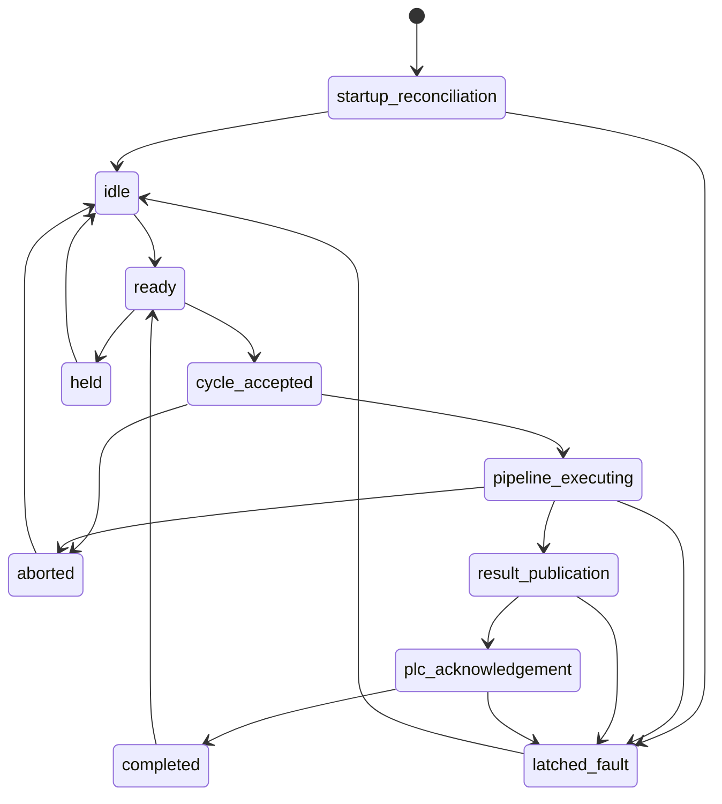

# Contracts and supervisory lifecycle

`src/inspection_platform/contracts.py` defines contract version `1.0`. The canonical result values are exactly `PASS`, `FAIL`, `NO_RESULT`, `FAULT`, and `ABORTED`. Callers must preserve their meanings; failure-like values are never silently translated into a product decision.

The fixed lifecycle is:

Phase 1 uses simulated result publication; it does not grant PLC authority. `CycleContext` is immutable and pins cycle identity, part, recipe, package, initiator, acceptance time, monotonic deadline, and clock status. `PipelineResult` must repeat the pinned package identity and contain ordered unique steps.

Capability requests contain a cycle ID, sequence, idempotency key, deadline, and cancellation token. Outcomes are exactly `SUCCEEDED`, `REJECTED`, `TIMED_OUT`, `CANCELLED`, or `FAULTED`.

Compatibility rules:

- Platform version is `0.1.0`; API prefix is `/api/v1`; contract version is `1.0`.
- Existing versioned contracts remain supported. An incompatible change requires a new version and a compatibility adapter or migration.
- Later phases consume Phase 1 contracts. Phase 1 must not depend on later hardware or HMI implementations.
