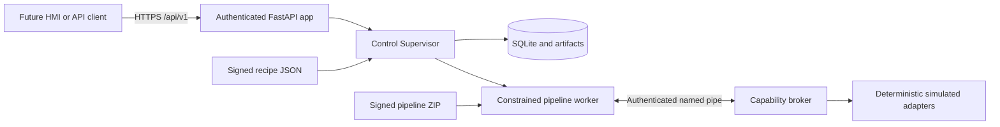

# Phase 1 architecture overview

Phase 1 is an offline platform kernel on the Windows Admin PC. It proves the contracts, trust chain, lifecycle, persistence, and isolated execution model without live PLC or SiMa dependencies.

The FastAPI process authenticates requests and owns externally visible commands. The Control Supervisor owns lifecycle decisions. A separate pipeline worker loads one exact signed package for one cycle. The broker validates capability declarations, deadlines, cancellation, request order, and repeat requests. Simulated adapters provide deterministic Phase 1 observations.

SQLite at `C:\ProgramData\InspectionPlatform\inspection.sqlite3` is the planned authoritative Admin-PC store. Artifacts are content-addressed below the same data root. Tests substitute temporary directories.

The older DIY, parity, capture, and board-runtime code is not connected to this kernel. It remains reference and experimentation material.

The detailed approved architecture is `04-replacement-architecture.md`.
