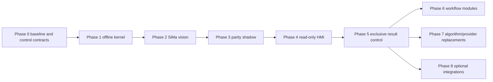

# Delivery phases and backward compatibility

All future phases depend on the terminology and logical contracts established by Phase 0. Phase 1 can be implemented and tested offline without resolved Modbus addresses, but production PLC writes cannot begin until the Phase 0 commissioning package is complete and approved.

Current work is Phase 1. It must be usable for CI, pipeline development, and training without SiMa, PLC, MES, or React. It is not complete until acceptance-to-durable-completion, restart recovery, rollback, serialization, isolation, fault injection, backup/restore, retention, disk faults, audit integrity, and operating procedures meet the architecture's completion boundary.

Phase 2 introduces the real SiMa vision provider while PLC control remains disabled. Phase 3 runs correlated shadow comparisons without control authority. Phase 4 adds a read-only HMI. Phase 5 is the earliest phase that may receive exclusive production result authority, and only after approved Phase 0 commissioning and Phase 1-4 acceptance.

Phases 6, 7, and 8 are independent branches after Phase 5. Earlier versioned contracts cannot be broken to simplify a later phase. Incompatible evolution requires a new contract/API version and a compatibility adapter or migration in the same release.
